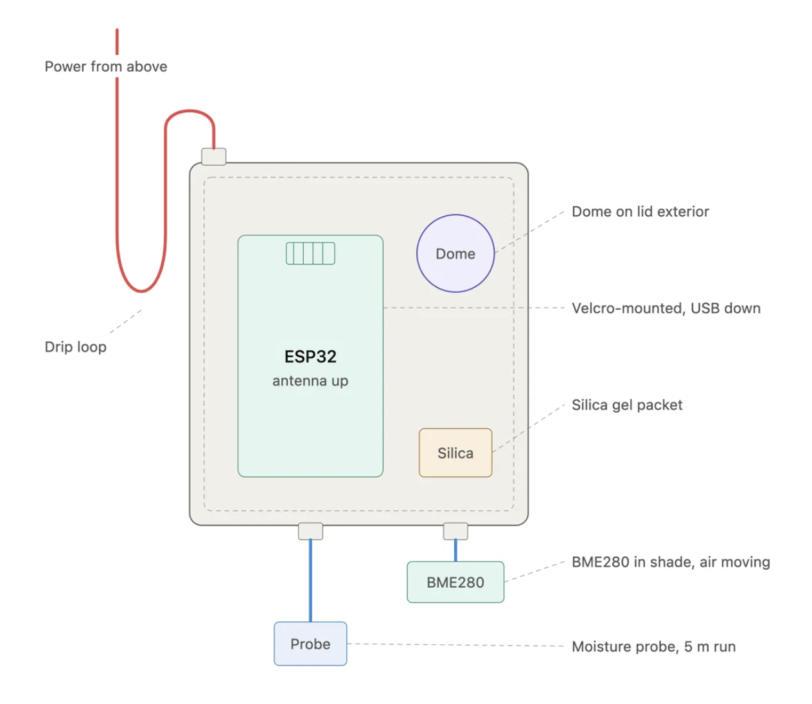

# desert_rose


A solar-exposed balcony, one Desert Rose in a pot, and an ESP32 that
reports how the plant is doing every ten minutes.

Soil moisture, light, air temperature and humidity are logged continuously,
stored locally in SQLite, and viewed through a Streamlit dashboard.



[Dashboard](dashboard.png)

## How it fits together


```
ESP32 (MicroPython)  ->  Adafruit IO  ->  puller.py  ->  balcony.db  ->  app.py
     every 10 min         30-day buffer     every 6h       SQLite       Streamlit
```

Adafruit IO deletes data after 30 days on the free tier, so it works as a
transport buffer rather than storage. `puller.py` copies readings into a local
SQLite file that never expires, and the dashboard reads from there.

Splitting it this way means the laptop does not have to be awake when a reading
is taken. The board pushes to a service that is always up; the laptop catches up
whenever it next runs.

## Hardware


| Part | Detail |
| --- | --- |
| Board | ESP32 WROOM-32E, MicroPython v1.29 |
| Soil moisture | Capacitive v1.2, analog on GPIO34, 3.3V |
| Light | BH1750 under a diffuser dome, I2C 0x23 |
| Temp / humidity | BME280, I2C 0x76 |
| Enclosure | IP65 box, 5 m USB run to a mains outlet |


- **Hardware I2C timed out on this board.** `SoftI2C` on pins 22 (SCL) and
  21 (SDA) works reliably where `I2C` did not.

The moisture sensor is calibrated against two anchor readings taken from
averaged samples - dry air and full immersion - and the percentage is a linear
interpolation between them, clamped to 0-100.

## Firmware notes

`main.py` runs a 60-second hardware watchdog. The sleep between cycles feeds it
once a second so an ordinary ten-minute wait is not mistaken for a hang, but a
genuine lockup still triggers a reboot without anyone visiting the balcony.

Each sensor is read inside its own `try`, so one loose cable costs a single
reading rather than the whole cycle.


## Running it


```bash
conda create -n balcony python=3.12
conda activate balcony
pip install streamlit pandas requests

cp config.example.py config.py    # then add your Adafruit IO username and key

python puller.py                  # backfills up to 30 days, safe to re-run
streamlit run app.py
```

`puller.py` is idempotent - every row is keyed on Adafruit's own record id and
inserted with `INSERT OR IGNORE`, so re-running it or overlapping the time
window can never duplicate data. It fetches one day at a time, which keeps each
request well under the API's 1000-record limit and removes any dependence on
result ordering.

On macOS a launchd agent runs the puller every six hours; see
`com.nikunj.balcony-puller.plist`. <!-- TODO: commit the plist, or delete this
line if you would rather not publish your local paths. -->

## Dashboard

Charts are Altair rather than the Streamlit defaults, mainly to get a secondary
axis for temperature against humidity - the two are inversely correlated and
separating them into two charts hides the relationship.

Readings that are physically impossible (humidity above 100%) are filtered at
read time rather than deleted, so the raw table stays intact and the thresholds
can be revised later. Values that are merely unusual - a bright afternoon
spiking the lux reading - are left alone.


## What is next


 - log the raw ADC count alongside the moisture percentage, so history survives a recalibration
 - move storage to the Raspberry Pi so the dashboard is always on
 - a locally hosted LLM on Pi to perform real-time analysis of the data and send out alerts
 - more pots/plants
